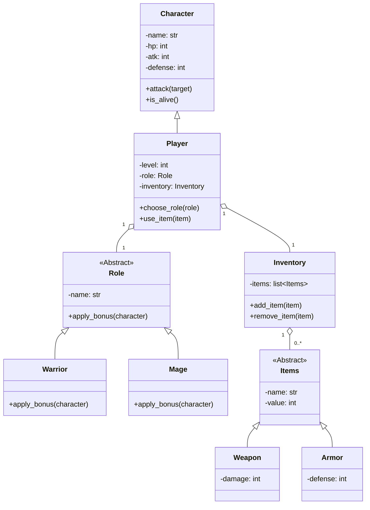

# 🎮 Text Based RPG

Just some school project made with love

## 👀 Overview
This project is a simple text-based RPG that utilizes Object-Oriented Programming (OOP) concepts. Players can create characters, manage inventory, and engage in battles with various roles and items.

## 🪶 Features
- Character creation with customizable attributes (name, health points, attack power, defense).
- Role selection for characters (e.g., Warrior, Mage).
- Inventory system to manage items (adding, removing, and listing items).
- Basic combat mechanics where characters can attack each other.

## 🏛️ Architecture & Class Diagram
This project follows an Object-Oriented design. The core of the architecture involves a base `Character` class, which is specialized into a `Player` class. The player manages an `Inventory` and can be assigned a `Role`. The `Items` are also structured using inheritance.



## 📂 Project Structure
```
text_based_rpg
├── main.py                # Entry point of the application
├── character              # Module for character-related classes
│   ├── __init__.py
│   ├── character.py       # Character class definition
│   └── role.py            # Role class definition
├── inventory.py           # inventory class definition
├── items.py               # items class definition
└── README.md              # Project documentation
```

## 👨‍💻 Setup Instructions
1. Clone the repository to your local machine.
2. Navigate to the project directory.
3. Run the game by executing:
   ```
   python main.py
   ```

## 🕹️ Gameplay Mechanics
- Players can create a character and choose a role after reaching level 5.
- Characters can engage in combat, taking turns to attack each other.
- Players can manage their inventory to equip items that enhance their abilities.

## 👤 Contributors

<table border="0" cellspacing="10" cellpadding="5">
  <tr>
    <td align="center" style="border: 1px solid #555; padding: 10px;">
      <a href="https://github.com/Kasanee-Teto">
        
      </a>
      <br/>
      <a href="https://github.com/Kasanee-Teto">Kasanee-Teto</a>
    </td>
    <td align="center" style="border: 1px solid #555; padding: 10px;">
      <a href="https://github.com/Solynixx">
        
      </a>
      <br/>
      <a href="https://github.com/Solynixx">Solynixx</a>
    </td>
    <td align="center" style="border: 1px solid #555; padding: 10px;">
      <a href="https://github.com/Milkdrinker-creator">
        
      </a>
      <br/>
      <a href="https://github.com/Milkdrinker-creator">Milkdrinker-creator</a>
    
  </tr>
</table>