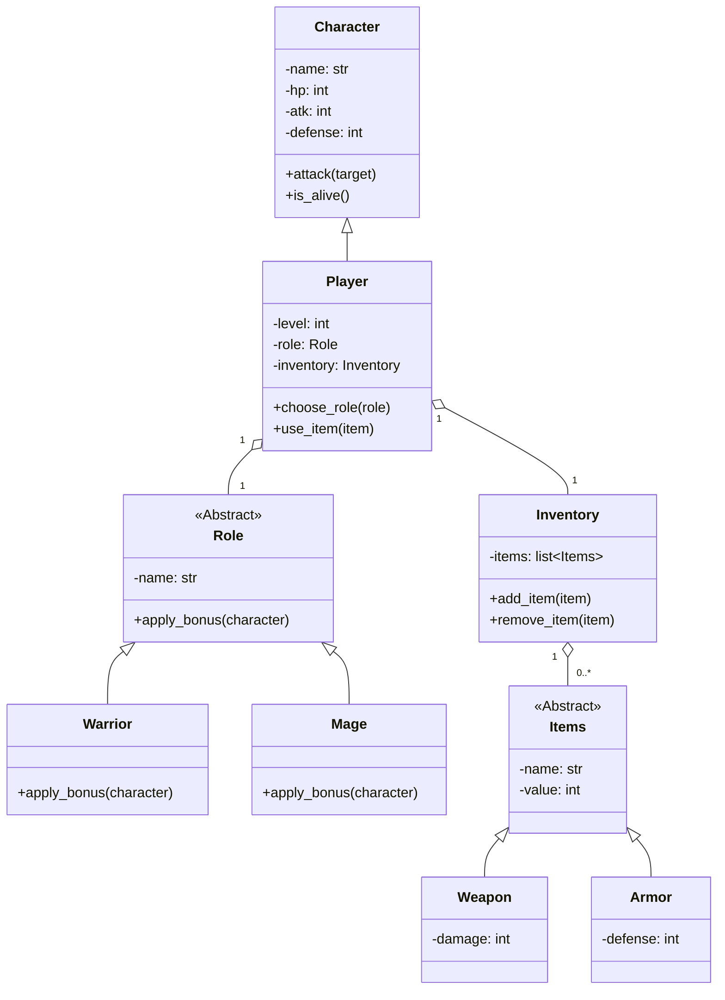

[EN](README.md) | [ID](docs/README_ID.md) | CN

# 🎮 文字角色扮演游戏

一个用爱制作的简单学校项目

## 👀 概述
本项目是一个简单的文字角色扮演游戏（RPG），它利用了面向对象编程（OOP）的概念。玩家可以创建角色、管理物品栏，并使用各种职业和物品进行战斗。

## 🪶 功能
- 创建角色并可自定义属性（名称、生命值、攻击力、防御力）。
- 为角色选择职业（例如，战士、法师）。
- 用于管理物品的物品栏系统（添加、移除和列出物品）。
- 基础的战斗机制，角色可以轮流互相攻击。

## 🏛️ 架构与类图
该项目遵循面向对象的设计。其核心架构涉及一个基础的 `Character` 类，并派生出 `Player` 子类。玩家管理一个 `Inventory` 并可以被分配一个 `Role`。`Items` 也同样使用继承结构。



## 📂 项目结构
```
text_based_rpg
├── main.py              # 应用程序的入口点
├── character            # 存放角色相关类的模块
│   ├── __init__.py
│   ├── character.py     # Character 类的定义
│   └── role.py          # Role 类的定义
├── inventory.py         # Inventory 类的定义
├── items.py             # Items 类的定义
└── README.md            # 项目文档
```

## 👨‍💻 设置说明
1. 将此仓库克隆到您的本地计算机。
2. 导航到项目目录。
3. 通过执行以下命令来运行游戏：
   ```
   python main.py
   ```

## 🕹️ 游戏机制
- 玩家可以创建角色，并在达到5级后选择一个职业。
- 角色可以参与战斗，轮流互相攻击。
- 玩家可以管理自己的物品栏，以装备能增强能力的物品。

## 👤 贡献者

<table border="0" cellspacing="10" cellpadding="5">
  <tr>
    <td align="center" style="border: 1px solid #555; padding: 10px;">
      <a href="https://github.com/Kasanee-Teto">
        
      </a>
      <br/>
      <a href="https://github.com/Kasanee-Teto">Kasanee-Teto</a>
    </td>
    <td align="center" style="border: 1px solid #555; padding: 10px;">
      <a href="https://github.com/Solynixx">
        
      </a>
      <br/>
      <a href="https://github.com/Solynixx">Solynixx</a>
    </td>
    <td align="center" style="border: 1px solid #555; padding: 10px;">
      <a href="https://github.com/Milkdrinker-creator">
        
      </a>
      <br/>
      <a href="https://github.com/Milkdrinker-creator">Milkdrinker-creator</a>
    </td>
  </tr>
</table>